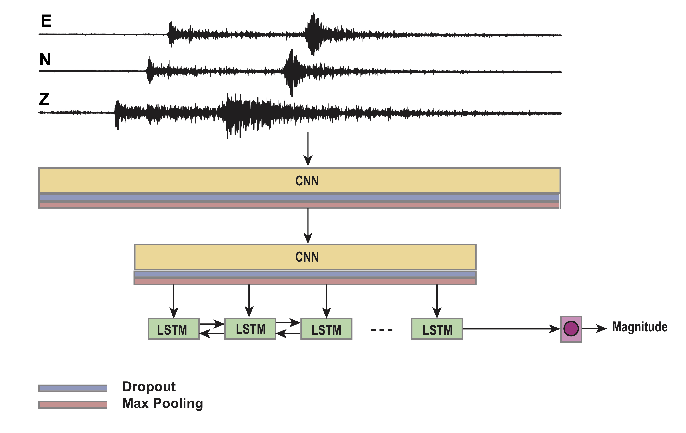
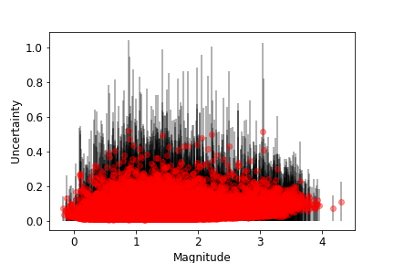
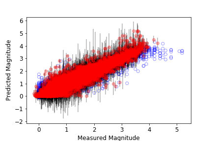
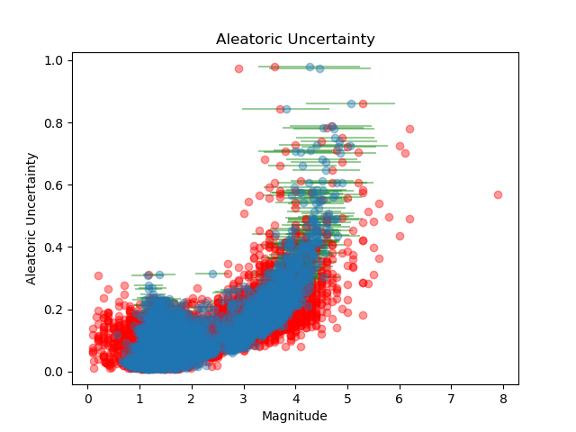
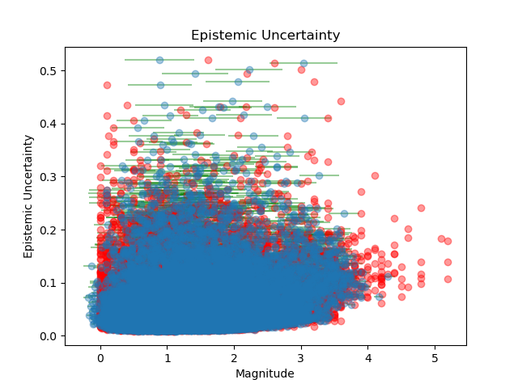
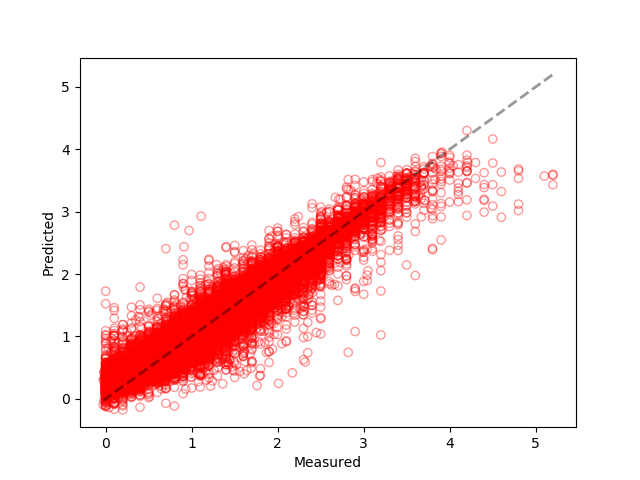

# MagNet   
## A Machine-Learning Approach for Earthquake Magnitude Estimation                                                                                                  

- Test results are provided for the performance comparison against other methods.  

- All the waveforms used for the test can be accessed from STEAD (https://github.com/smousavi05/STEAD) using the trace_name. 

### You can get the paper from here:
Link 1: 
https://agupubs.onlinelibrary.wiley.com/doi/pdf/10.1029/2019GL085976

Link 2:
https://www.researchgate.net/publication/338184318_A_Machine-Learning_Approach_for_Earthquake_Magnitude_Estimation

-------------------------------------
## Reference:

`Mousavi, S. M., & Beroza, G. C. (2019). A Machine‐Learning Approach for Earthquake Magnitude Estimation. Geophysical Research Letters.` 

BibTeX:

    @article{mousavi2019machine,
      title={A Machine-Learning Approach for Earthquake Magnitude Estimation},
      author={Mousavi, S Mostafa and Beroza, Gregory C},
      journal={Geophysical Research Letters},
      year={2019},
      publisher={Wiley Online Library}
    }

-------------------------------------

The size of an earthquake at its source is measured from the amplitude (or sometimes the duration) of the ground motion recorded on seismic instruments, and is expressed in terms of magnitude. Magnitude is a logarithmic measure and usually is measured based on data recorded by multiple stations after applying some pre‐proccessing and corrections to the raw signals. Here, we introduce the first successful deep‐learning approach to estimate directly the magnitude from raw seismic signals recorded on a single station.

  

